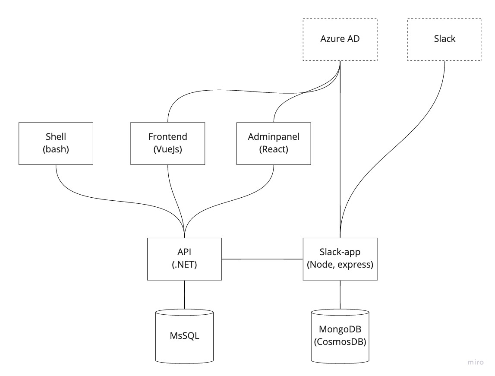

# AlvTime

> Welcome to the Alvtime monorepo. Alvtime is the internal timekeeping system for Alv AS. Below you can find a list of the services that make up the system.

## Packages

| Packages                                    | Type           | Description                                    |
| ------------------------------------------- | -------------- | ---------------------------------------------- |
| [Adminpanel](./packages/adminpanel)         | Frontend       | Admin panel for Alvtime                        |
| [Frontend](./packages/frontend)             | Frontend       | Enduser frontend for Alvtime                   |
| [Slack-app](./packages/slack-app)           | Slack-app      | Slack app                                      |
| [Api](./packages/api)                       | Backend        | Backend api                                    |
| [Charts](./packages/charts)                 | Charts         | Helm charts                                    |
| [Shell](./packages/shell)                   | Terminal CLI   | Terminal ClI tool for interacting with Alvtime |

## Architecture

## Development / Contribution

The following is adapted from [Release Flow - Azure DevOps | Microsoft Docs](https://docs.microsoft.com/en-us/azure/devops/learn/devops-at-microsoft/release-flow)

### 1. Branch

The first step when a developer wants to fix a bug or implement a feature is to create a new branch off of our main integration branch, master. Thanks to Git's lightweight branching model, we create these short-lived "topic" branches any and every time we want to write some code. Developers are encouraged to commit early and to avoid long-running feature branches by using feature flags.

### 2. Start the development environment

This can be done in several different ways. Select the method that suits you and the operating system of your choice. If you encounter situations where it is required to login, please ask one of your colleagues for a username and password. We have set up dummy users that can be used for development. It is also possible to combine the two methods as you wish.

#### Using a local setup

Dependencies:

- [Node.js 14](https://nodejs.org/en/)
- [.NET Core 3.1](https://dotnet.microsoft.com/download/dotnet/3.1)
- [MsSQL](https://www.microsoft.com/en-us/sql-server/sql-server-downloads)
- [MongoDB](https://www.mongodb.com/try/download/enterprise)

Follow the instructions in the Readme file in each of the packages and start the services you need. The architecture drawing above is a good starting point to decide what services you need to start up to be able to accomplish your task.

#### Using docker

Dependencies:

- [Docker](https://www.docker.com/products/docker-desktop)

A docker compose development environment has been defined for this project in `docker-compose.yaml`. This enables the whole or part of the local environment to be started using docker. Several helper commands have been added to the `run` script file. Have a quick look through the `run` file to find some of the possibilities. In order to start the frontend development server, backend api and database, just run `./run frontend` from the project root. The first time this is done, docker downloads all the necessary images and compiles the necessary code. This might take some time. The next time you start the development environment is much faster. To shut down the development environment, run `./run down`.

Whenever a dependency is added to the frontend or the backend code is changed you have to rebuild the container to see the changes. This is done by shutting down the environment `./run down` and running `docker-compose build <service name>`. For example running `docker-compose build frontend` will download all the dependencies inside the container and make them available to the development server. Make sure to run `docker-compose build api` to rebuild the api backend service and include changes.

### 3. Run Tests and build all the services

Run `./run build` from the root of the project.

### 5. Push

When the developer is ready to get their changes integrated and ship their changes to the rest of the team, they push their local branch to a branch on the server, and open a pull request.

### 6. Pull Request

We use Github Pull Requests to control how developers branches are merged into master. Pull Requests ensure that our branch policies are satisfied: first, we build the proposed changes and run a quick test pass. Next, we require that one other members of the team review the code and approve the changes. Code review picks up where the automated tests left off, and are particularly good at spotting architectural problems. Manual code reviews ensure that more engineers on the team have visibility into the changes and that code quality remains high.

### 7. Merge

Once all the build policies are satisfied and reviewers have signed off, then the pull request is completed. This means that the topic branch is merged into the main integration branch, master.

# Deployment from local machine

Run `az login` to login to your azure account and then run `./run deploy test` or `./run deploy prod` from the root of the project.
