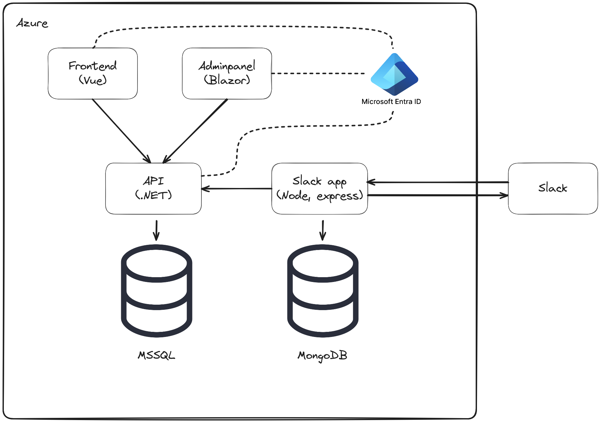

## GitHub Actions Status
- [](https://github.com/Alv-no/alvtime/actions/workflows/adminpanel-workflow-runner.yml)
- [](https://github.com/Alv-no/alvtime/actions/workflows/api-workflow-runner.yml)
- [](https://github.com/Alv-no/alvtime/actions/workflows/migrationclient-workflow-runner.yml)
- [](https://github.com/Alv-no/alvtime/actions/workflows/azure-static-web-apps-red-sand-043c70a03.yml)
- [](https://github.com/Alv-no/alvtime/actions/workflows/azure-static-web-apps-mango-island-0a2b55803.yml)
- [](https://github.com/Alv-no/alvtime/actions/workflows/azure-static-web-apps-zealous-wave-0708ca403.yml)
- [](https://github.com/Alv-no/alvtime/actions/workflows/azure-static-web-apps-kind-water-073df6f03.yml)

# AlvTime

> Welcome to the Alvtime monorepo. Alvtime is the internal timekeeping system for Alv AS. Below you can find a list of the services that make up the system.

## Packages

| Packages                            | Type         | Description                                    |
| ----------------------------------- | ------------ | ---------------------------------------------- |
| [Adminpanel](./packages/adminpanel) | Frontend     | Admin panel for Alvtime                        |
| [Frontend](./packages/frontend)     | Frontend     | Enduser frontend for Alvtime                   |
| [Slack-app](./packages/slack-app)   | Slack-app    | Slack app                                      |
| [Api](./packages/api)               | Backend      | Backend api                                    |                                  |
| [Shell](./packages/shell)           | Terminal CLI | Terminal ClI tool for interacting with Alvtime |

## Architecture



## Development / Contribution

The following is adapted from [Release Flow - Azure DevOps | Microsoft Docs](https://docs.microsoft.com/en-us/azure/devops/learn/devops-at-microsoft/release-flow)

### 1. Branch

The first step when a developer wants to fix a bug or implement a feature is to create a new branch off of our main integration branch, main. Thanks to Git's lightweight branching model, we create these short-lived "topic" branches any and every time we want to write some code. Developers are encouraged to commit early and to avoid long-running feature branches by using feature flags. We use the following naming convention for branching: new features or improvements are named `us/{issue-id}/{issue-description}`. Bugs are named `fix/{issue-id}/{issue-description}`.

### 2. Start the development environment

This can be done in several different ways. Select the method that suits you and the operating system of your choice. If you encounter situations where it is required to login, please ask one of your colleagues for a username and password. We have set up dummy users that can be used for development. It is also possible to combine the two methods as you wish.

#### a) Using docker (recommended)

Dependencies:

- [Docker](https://www.docker.com/products/docker-desktop)

A docker compose development environment has been defined for this project in `docker-compose.yaml`. This enables the whole or part of the local environment to be started using docker. `docker-compose up --build -d frontend-v3` will start the frontend client with all dependencies (API and database). The API can be run using both Docker or from your favourite IDE, they will both work identically. For running only API or database, simply replace `frontend-v3` with `api` or `db` in the `docker-compose` command.

Whenever a dependency is added to the backend code is changed you have to rebuild the container to see the changes. This is done by shutting down the container `docker-compose down api` and running `docker-compose up --build -d api`.

Note: For running the adminpanel - The API service requires a secret to access the Microsoft Graph API. This secret can be placed in a separate `.env`-file at the root directory. The secret will be read by `docker-compose` and will not be included in version control.

```
#.env
AZUREAD_GRAPH_CLIENT_SECRET=<secret>
```

#### b) Using a local setup

Dependencies:

- [Node.js 14](https://nodejs.org/en/)
- [.NET Core 9.0](https://dotnet.microsoft.com/download/dotnet/9.0)
- [MSSQL](https://www.microsoft.com/en-us/sql-server/sql-server-downloads)
- [MongoDB](https://www.mongodb.com/try/download/enterprise) (only for Slack app)

Follow the instructions in the Readme file in each of the packages and start the services you need. The architecture drawing above is a good starting point to decide what services you need to start up to be able to accomplish your task.

##### Mac with ARM processor

The MSSQL server doesn't compile on the new ARM processors for Mac and you will need to use docker with either `docker compose` or as a standalone container for a local setup. Both options require you to to enable Rosetta in docker. In docker Desktop, go to Settings and enable "Use Rosetta for x86/amd64 emulation on Apple Silicon" and restart docker. You can either run a single docker container with a local setup or use docker as usual.

Another option is to use an SQL server in Azure, more info [here](https://github.com/Alv-no/alvtime/issues/368#issuecomment-892052356).

### 3. Run Tests and build all the services

Run `docker-compose build` from the root of the project.

### 4. Push

When the developer is ready to get their changes integrated and ship their changes to the rest of the team, they push their local branch to a branch on the server, and open a pull request.

### 5. Pull Request

We use Github Pull Requests to control how developers branches are merged into main. Pull Requests ensure that our branch policies are satisfied: first, we build the proposed changes and run a quick test pass. Next, we require that one other members of the team review the code and approve the changes. Code review picks up where the automated tests left off, and are particularly good at spotting architectural problems. Manual code reviews ensure that more engineers on the team have visibility into the changes and that code quality remains high.

### 6. Merge

Once all the build policies are satisfied and reviewers have signed off, then the pull request is completed. This means that the topic branch is merged into the main integration branch, main. 

### 7. Deploy

A merge to the main branch will trigger an automatic deploy to the test environment, `test-alvtime.no`. For deploy to production, a manual approval is required by an admin user.
