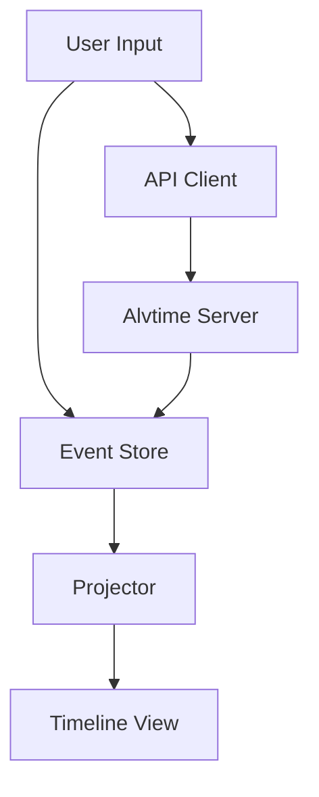

# 🚀 Alvtime Rust CLI

[](https://www.rust-lang.org/)
[](#license)

A powerful, terminal-based CLI tool for time tracking and project management with Alvtime integration. Built with Rust for maximum performance and reliability, featuring an intuitive interactive shell, offline support, and comprehensive timeline visualization.


## ✨ Features

### 🖥️ **Interactive Shell Experience**
- **Rich Command Line Interface**: Built with `rustyline` for a readline-style experience with command history and tab completion
- **Real-time Timeline Visualization**: Interactive visual timeline supporting Day, Week, Month, and Year views
- **Live Updates**: Automatic screen refresh and state management for seamless workflow

### ⏱️ **Comprehensive Time Tracking**
- **Smart Time Management**: Start, stop, and insert breaks with intelligent auto-break detection
- **Multi-view Timeline**: Switch between day, week, month, and year views with shortcuts (`v d`, `v w`, `v m`, `v y`)
- **Interactive Calendar**: Monthly calendar view for easy navigation and historical entry editing

### 📊 **Advanced Task Management**
- **Favorite Tasks**: Quick access to frequently used tasks for faster time entry
- **Real-time Sync**: Seamless integration with Alvtime API for task synchronization
- **Offline-First Design**: Work offline with local event sourcing and sync when ready

### 🔄 **Robust Data Management**
- **Event-Sourced Architecture**: Full undo/redo support for all actions
- **Local Storage**: High-performance `sled` database for offline persistence
- **Intelligent Caching**: Smart caching of tasks, holidays, and time entries

### 🔧 **Developer-Friendly**
- **Shell Completions**: Auto-generated completions for bash, zsh, and fish
- **Flexible API Integration**: Clean separation between local and remote operations
- **Error Handling**: Graceful degradation when API is unavailable

## 📋 Prerequisites

Before installing Alvtime CLI, ensure you have:

- **Rust & Cargo** (2024 Edition) - [Install here](https://www.rust-lang.org/tools/install)
- **Alvtime Account** with API access token
- **Terminal Environment** (macOS, Linux, or WSL on Windows)

## 🛠️ Installation

### Option 1: Quick Install via Make

The fastest way to install Alvtime CLI:

```bash
# Clone the repository
git clone <repository-url>
cd alvtime-cli

# Build and install to ~/.local/bin
make install

# Add to PATH if needed
export PATH="$HOME/.local/bin:$PATH"
```

### Option 2: Manual Build

For custom installation paths:

```bash
# Build release version
cargo build --release

# Install to specific directory
make install DESTDIR=/usr/local  # or your preferred path

# Verify installation
atime --help
```

### Option 3: Cargo Install (Future)

```bash
# Note: Will be available once published to crates.io
cargo install atime
```

## ⚙️ Configuration

### Initial Setup

1. **Launch the CLI**:
   ```bash
   atime
   ```

2. **Configure your Alvtime token**:
   ```bash
   > config set-token YOUR_ALVTIME_PERSONAL_ACCESS_TOKEN
   ```

3. **Set up favorite tasks** (optional but recommended):
   ```bash
   > favorites add
   ```

### Configuration Options

| Setting | Command | Description |
|---------|---------|-------------|
| **API Token** | `config set-token <token>` | Your Alvtime personal access token |
| **Auto-break** | `config autobreak <on/off>` | Enable automatic break detection |

### Environment Variables

```bash
# Optional: Set custom API URL
export ALVTIME_API_URL="https://your-alvtime-instance.com"

# Optional: Set custom storage path
export ALVTIME_STORAGE_PATH="/path/to/your/data"
```

## 🎯 Usage

### Interactive Shell Mode

Start the interactive shell for the full experience:

```bash
atime --shell
# or simply
atime
```

### Command Line Mode

Use individual commands for scripting and automation:

```bash
# Start tracking a task
atime start "Project Meeting"

# View today's timeline
atime view day

# Sync with server
atime sync
```

### 📚 Command Reference

#### ⏰ Time Management

| Command | Shortcut | Description | Example |
|---------|----------|-------------|---------|
| `start [task]` | `s` | Start tracking time on a task | `start "Code Review"` |
| `break` | `b` | Start a break | `break` |
| `stop` | `st` | Stop current activity | `stop` |
| `edit` | `e` | Edit entries interactively | `edit` |

#### 📅 View & Navigation

| Command | Shortcut | Description | Example |
|---------|----------|-------------|---------|
| `view day` | `v d` | Switch to day view | `view week` |
| `view week` | `v w` | Switch to week view | `view month` |
| `view month` | `v m` | Switch to month view | `view year` |
| `month-view` | `mv` | Interactive calendar | `month-view` |

#### 🔄 Synchronization

| Command | Description | Example |
|---------|-------------|---------|
| `sync` | Fetch tasks and reconcile with server | `sync` |
| `push` | Push local changes to Alvtime | `push` |

#### ⭐ Favorites & Tasks

| Command | Description | Example |
|---------|-------------|---------|
| `favorites add` | Add current task to favorites | `favorites add` |
| `favorites remove` | Remove task from favorites | `favorites remove` |
| `favorites list` | Show all favorite tasks | `favorites list` |

#### 🛠️ System Commands

| Command | Description | Example |
|---------|-------------|---------|
| `undo` | Undo last action | `undo` |
| `redo` | Redo last undone action | `redo` |
| `config` | View/modify configuration | `config` |
| `timebank` | View timebank information | `timebank` |
| `help` | Show help text | `help` |
| `quit` | Exit application | `quit` |

### 💡 Usage Examples

#### Quick Daily Workflow

```bash
# Start your workday
> start "Development - Feature X"

# Take a coffee break
> break

# Continue working
> start "Development - Feature X"

# View today's progress
> view day

# Push changes to server
> push

# Exit
> quit
```

#### Weekly Planning

```bash
# Switch to week view
> view week

# Start tracking weekly planning
> start "Weekly Planning"

# Navigate through the week
> view month

# Use interactive calendar
> month-view
```

#### Managing Favorites

```bash
# Add frequently used tasks
> favorites add
Select task from list... ✓

# Quick start with favorite
> start "Code Review"

# Remove from favorites if no longer needed
> favorites remove
```

## 🔧 Shell Completions

Generate shell completions for better command-line experience:

### Zsh

```bash
# Generate and source completions
source <(atime completions zsh)

# Or install permanently
atime completions zsh > /usr/local/share/zsh/site-functions/_atime
```

### Bash

```bash
# Generate and source completions
source <(atime completions bash)

# Or install permanently
atime completions bash > /etc/bash_completion.d/atime
```

### Fish

```bash
# Generate completions
atime completions fish > ~/.config/fish/completions/atime.fish
```

## 🏗️ Architecture

### Core Components

- **🎯 Event Store**: Persistent event sourcing with `sled` database
- **🔄 Projector**: State reconstruction from events
- **🌐 API Client**: Alvtime integration with HTTP client
- **🖥️ Shell Interface**: Interactive command-line experience
- **📊 Timeline View**: Multi-mode timeline visualization

### Data Flow



## 🤝 Contributing

This is an internal Alvtime project. For contributions:

1. **Fork the repository**
2. **Create a feature branch**: `git checkout -b feature/amazing-feature`
3. **Make your changes** with proper tests
4. **Run the test suite**: `make test`
5. **Submit a pull request**

### Development Setup

```bash
# Clone and setup
git clone <repository-url>
cd alvtime-cli

# Install development dependencies
rustup component add rustfmt clippy

# Run formatting and linting
cargo fmt
cargo clippy

# Run tests
cargo test
```

### Code Style

- Follow Rust standard formatting (`cargo fmt`)
- Ensure clippy passes without warnings
- Write comprehensive tests for new features
- Document public APIs

## 🐛 Troubleshooting

### Common Issues

**❓ "Failed to fetch tasks from API"**
```bash
# Check your token configuration
> config

# Re-set your token
> config set-token YOUR_TOKEN
```

**❓ "No tasks found"**
```bash
# Sync with server to fetch tasks
> sync

# Check favorites
> favorites list
```

**❓ "Permission denied" during installation**
```bash
# Use user installation directory
make install DESTDIR=$HOME/.local
```

### Debug Mode

Enable debug logging:
```bash
RUST_LOG=debug atime --shell
```

## 📊 Performance

- **Fast Startup**: < 100ms cold start time
- **Low Memory**: < 10MB typical memory usage
- **Efficient Storage**: Optimized event sourcing with `sled`
- **Responsive UI**: Real-time updates with minimal redraws

## 🔒 Security

- **Token Storage**: Personal access tokens stored securely in local configuration
- **Local-First**: Sensitive data remains on your machine
- **HTTPS Only**: All API communication over secure connections
- **No Logging**: No sensitive data written to logs

## 📈 Roadmap

- [ ] **Mobile Companion**: React Native app for mobile time tracking
- [ ] **Advanced Analytics**: Detailed time reporting and insights
- [ ] **Plugin System**: Extensible architecture for custom integrations
- [ ] **Team Features**: Shared projects and collaborative time tracking
- [ ] **Calendar Integration**: Sync with Google Calendar, Outlook
- [ ] **Desktop Notifications**: Reminders and break notifications

## 📄 License

**Internal Alvtime Project** - All rights reserved.

For external use or licensing inquiries, please contact the Alvtime team.

## 🙋‍♂️ Support

- **Documentation**: This README and inline help (`help` command)
- **Issues**: Report bugs and feature requests via GitHub Issues
- **Community**: Join our internal Slack channel #alvtime-cli
- **API Docs**: [Alvtime API Documentation](https://docs.alvtime.no/api)

---

**Made with ❤️ by the Alvtime Team**

*Happy time tracking! 🎉*
